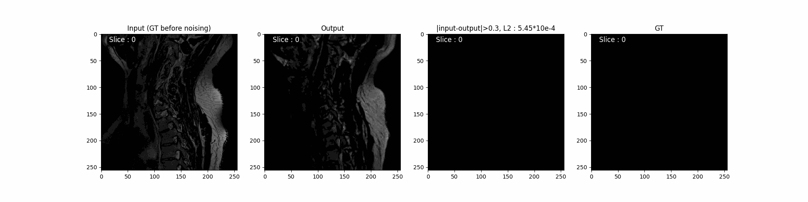
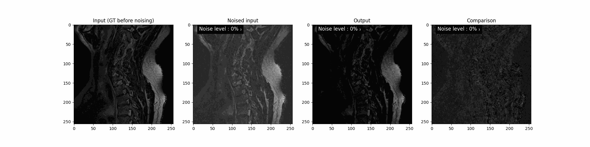

# Counterfactual_synthesis_for_lesion_segmentation

This project aims at segmenting lesions in the Spinal Cord on MRI images. 
The main idea consists in training model on healthy patients that is able to recover the initial image after degradation. Then using it on images with lesions and segment the lesion based on the differences between original and recovered image.

## Medical Diffusion Implementation

This branch is extensively based on [Medical Diffusion](https://github.com/FirasGit/medicaldiffusion), which is the official implementaion of Original paper : ["Medical Diffusion: Denoising Diffusion Probabilistic Models for 3D Medical Image Synthesis"](https://arxiv.org/abs/2211.03364).
It aditionnaly features : 

- [BIDS](https://bids.neuroimaging.io/) datasets support
  - Automatically browse into images
  - Can select certain contrasts
  - Can join derivate files to the main image
  - Can select images with certain derivates available
- GPU memory optimisation trick
  - Allow user to split VQ-GAN decoding in order to extend maximum image size.
- [T2I-Adapater](https://arxiv.org/abs/2302.08453) implementation
  - Train and use T2I-Adapters (adapted from [T2I-Adapater](https://github.com/TencentARC/T2I-Adapter))
  - Allow diffusion control from BIDS derivates after appropriate training
- Lesion sgementation by Counterfactual Synthesis
  - Image-to-Image with monitorable noising strengh
  - Analyse differences to extract lesion segmentation





### System Requirements
This code has been tested on Ubuntu 20.04 and an NVIDIA Quadro RTX 6000 GPU. Furthermore it was developed using Python v3.8.

### Setup
In order to run our model, we suggest you create a virtual environment 
```
conda create -n medicaldiffusion python=3.8
``` 
and activate it with 
```
conda activate medicaldiffusion
```
Subsequently, download and install the required libraries by running 
```
pip install -r requirements.txt
```

### Train on a BIDS dataset

If you have a dataset that follow the [BIDS](https://bids.neuroimaging.io/) standard, you can use the BIDSDataset class to load your data. It will automatically select all the nifti files in the "sub-##" folders with the given contrasts.         

The file "dataset/bids.py" can be modified to manage image shape and data augmentation transforms

All you need to do now is just specify the path to this root directory the way we have dealt with it before, i.e.,

#### Train VQ-GAN

```
PL_TORCH_DISTRIBUTED_BACKEND=gloo python train/train_vqgan.py dataset=bids dataset.root_dir=<ROOT_DIRECTORY> dataset.is_VQGAN=True dataset.contrasts=[<DESIRED_CONTRATS>] dataset.derivatives=False model=vq_gan_3d model.default_root_dir=<RESULT_FOLDER> model.gpus=1 model.default_root_dir_postfix='own_dataset' model.precision=16 model.embedding_dim=8 model.n_hiddens=16 model.downsample=[2,2,2] model.num_workers=32 model.gradient_clip_val=1.0 model.lr=3e-4 model.discriminator_iter_start=10000 model.perceptual_weight=4 model.image_gan_weight=1 model.video_gan_weight=1 model.gan_feat_weight=4 model.batch_size=1 model.n_codes=16384 model.accumulate_grad_batches=1 model.decoding_diviser=1
```

Note that since "max_epochs" is set to '-1' in "config/model/vq_gan_3D.yaml", the training will go forever unless it's manually stopped. Considerer modifying the config file if you don't want this behaviour.

Note that you can use multiple GPUs with model.gpus=nb_of_desired_GPUS as long as allowed be availability.

#### Train Diffusion model

To train the diffusion model in the latent space of the previously trained VQ-GAN model, you need to run the following command
```
python train/train_ddpm.py model=ddpm dataset=bids dataset.root_dir=<ROOT_DIRECTORY> dataset.contrasts=[<DESIRED_CONTRATS>] dataset.derivatives=False model.results_folder=<DESIRED_RESULT_FOLDER> model.results_folder_postfix='own_dataset' model.vqgan_ckpt=<VQGAN_CHECKPOINT> model.diffusion_img_size=128 model.diffusion_depth_size=16 model.diffusion_num_channels=8 model.dim_mults=[1,2,4,8] model.batch_size=1 model.gpu_id=0
```
Where you again need to specify the path to the VQ-GAN checkpoint from before (e.g. ```model.vqgan_ckpt='/home/<user>/Desktop/medicaldiffusion/checkpoints/vq_gan/DEFAULT/own_dataset/lightning_logs/version_0/checkpoints/latest_checkpoint.ckpt'```)

You should as well make sure to specify the shape you wich to center crop/pad your images with : (2 * diffusion_depth_size,2 * model.diffusion_img_size, 2 * model.diffusion_img_size)

#### Train T2I-Adapter model
To train the T2I-Adapter model that add a control channel to the pre-trained diffusion model, you need to run the following command :
```
python train/train_T2I.py model=T2I dataset=bids dataset.root_dir=<INSERT_PATH_TO_ROOT_DIRECTORY> dataset.contrasts=[<DESIRED_CONTRATS>] dataset.derivatives=True dataset.mandatory_derivates=[control_derivate] model.results_folder=<DESIRED_RESULT_FOLDER> model.results_folder_postfix='own-dataset' model.vqgan_ckpt=<VQGAN_CHECKPOINT> model.diffusion_pt=<DDPM_CHECKPOINT> model.diffusion_img_size=128 model.diffusion_depth_size=16 model.diffusion_num_channels=8 model.dim_mults=[1,2,4,8] model.batch_size=1 model.gpu_id=0
```

### Train on an un-formated dataset
To simpify the dataloading for your own dataset, the original repo provides a default dataset that simply requires the path to the folder with your NifTI images inside, i.e.

    root_dir/					# Path to the folder that contains the images
    ├── img1.nii                # The name of the NifTI file is not important
    ├── img2.nii                    
    ├── img3.nii                     
    ├── ...                    

The file "dataset/default.py" can be modified to manage image shape and data augmentation transforms

The commands to launch VQGAN training becomes :

```
PL_TORCH_DISTRIBUTED_BACKEND=gloo python train/train_vqgan.py dataset=default dataset.root_dir=<ROOT_DIRECTORY> model=vq_gan_3d model.default_root_dir=<RESULT_FOLDER> model.gpus=1 model.default_root_dir_postfix='own_dataset' model.precision=16 model.embedding_dim=8 model.n_hiddens=16 model.downsample=[2,2,2] model.num_workers=32 model.gradient_clip_val=1.0 model.lr=3e-4 model.discriminator_iter_start=10000 model.perceptual_weight=4 model.image_gan_weight=1 model.video_gan_weight=1 model.gan_feat_weight=4 model.batch_size=1 model.n_codes=16384 model.accumulate_grad_batches=1 model.decoding_diviser=1
```

And the difussion model's becomes :

```
python train/train_ddpm.py model=ddpm dataset=default dataset.root_dir=<ROOT_DIRECTORY> model.results_folder=<DESIRED_RESULT_FOLDER> model.results_folder_postfix='own_dataset' model.vqgan_ckpt=<VQGAN_CHECKPOINT> model.diffusion_img_size=128 model.diffusion_depth_size=16 model.diffusion_num_channels=8 model.dim_mults=[1,2,4,8] model.batch_size=1 model.gpu_id=0
```

Note that such dataset cannot take advantage of contrasts or derivate information so T2I cannot be trained with unbidsified data just yet.


## Acknowledgement
This code is heavily build on the following repositories:

* https://github.com/TencentARC/T2I-Adapter

* https://github.com/FirasGit/medicaldiffusion itself heavely based on : 

  * https://github.com/SongweiGe/TATS
  * https://github.com/lucidrains/denoising-diffusion-pytorch
  * https://github.com/lucidrains/video-diffusion-pytorch
